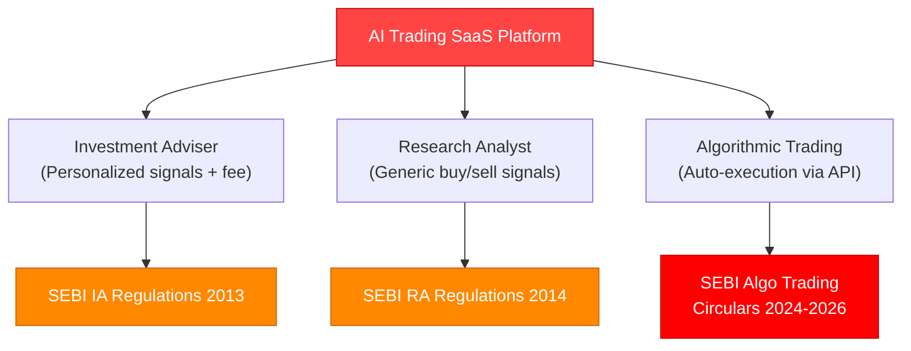
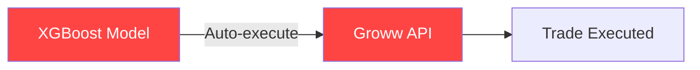
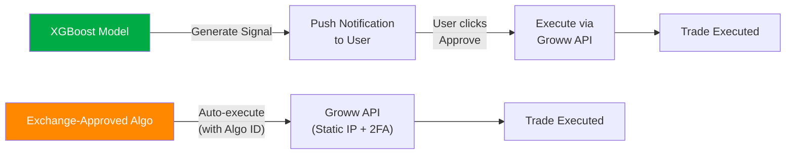

# Comprehensive Regulatory Compliance Analysis
## AI-Powered Automated Trading SaaS Platform – India

> [!CAUTION]
> **CRITICAL FINDING:** Your current architecture of **fully automated trade execution** (AI generates signal → auto-executes without per-trade user consent) is **prohibited under current SEBI regulations** for retail investors unless operated through a registered Portfolio Management Service (PMS) with ₹50 Crore net worth and ₹50 Lakh minimum client ticket size. You **must** restructure the execution model before commercial launch.

---

## Table of Contents

1. [Executive Summary & Strategic Conclusion](#executive-summary)
2. [SEBI Investment Advisers Regulations](#1-sebi-investment-advisers-regulations-2013)
3. [SEBI Research Analysts Regulations](#2-sebi-research-analysts-regulations-2014)
4. [SEBI Stock Brokers Regulations](#3-sebi-stock-brokers-regulations)
5. [SEBI Algorithmic Trading Framework](#4-sebi-algorithmic-trading-framework-2024-2026)
6. [Digital Personal Data Protection Act](#5-digital-personal-data-protection-act-dpdpa-2023)
7. [Information Technology Act & Rules](#6-information-technology-act-2000-and-it-rules)
8. [RBI Guidelines](#7-rbi-guidelines)
9. [Record Retention Requirements](#8-record-retention-requirements)
10. [Audit Requirements](#9-audit-requirements)
11. [Consumer Protection Requirements](#10-consumer-protection-requirements)
12. [API/Broker Integration Compliance](#11-apibroker-integration-compliance-groww)
13. [Risk Disclosure Requirements](#12-risk-disclosure-requirements)
14. [User Consent Requirements](#13-user-consent-requirements)
15. [Mandatory Agreements & Contracts](#14-mandatory-agreements--contracts)
16. [Mandatory Website/App Disclosures](#15-mandatory-websiteapp-disclosures)
17. [Advertising & Marketing Compliance](#16-advertising--marketing-compliance)
18. [Ongoing Communication Requirements](#17-ongoing-communication-requirements)
19. [Clause-by-Clause Implementation Matrix](#clause-by-clause-implementation-matrix)
20. [Recommended Architecture Changes](#recommended-architecture-changes)

---

## Executive Summary

### The Core Regulatory Problem

Your platform sits at the intersection of **three SEBI regulatory domains** simultaneously:



### Strategic Decision Required

You must choose one of two registration paths:

| Path | Registration | Net Worth | Auto-Execution? | Fee Cap | Complexity |
|------|-------------|-----------|-----------------|---------|------------|
| **Path A: Research Analyst** | SEBI RA | ₹50L (corporate) | ❌ Signal only, user clicks "Execute" | No cap on subscription | Lower |
| **Path B: Investment Adviser** | SEBI RIA | ₹50L (corporate) | ❌ User must approve each trade | Max ₹1.25L/yr or 2.5% AUA | Higher |

> [!IMPORTANT]
> **Neither path allows fully automated execution.** Under the 2026 Algo Trading framework, users can authorize an exchange-approved Algo ID for semi-automated execution via OAuth + 2FA, but the algo must be exchange-approved through the broker (Groww) first.

### Recommended Path: Research Analyst + Algo Vendor Partnership

**Rationale:**
- Lower compliance burden than RIA
- No fee cap on subscriptions (RIA caps at ₹1.25L/year)
- No mandatory per-client risk profiling
- Can distribute generic AI signals to all subscribers
- Partner with Groww as an API Vendor for exchange-approved algo execution

---

## 1. SEBI (Investment Advisers) Regulations, 2013

### Applicability: ⚠️ LIKELY YES (if signals are personalized)

| Criterion | Assessment |
|-----------|------------|
| Provides investment advice? | YES – AI buy/sell signals constitute advice |
| For consideration (fee)? | YES – subscription fees |
| Personalized to client? | DEPENDS on implementation |
| Automated advice (Robo-advisor)? | YES – SEBI classifies these under IA |

### Key Requirements

#### Registration (Regulation 3) — **MANDATORY**
- **Status:** Must register before commercial launch
- **Corporate Net Worth:** ₹50 Lakhs
- **Individual Net Worth:** ₹5 Lakhs
- **NISM Certification:** Series X-A & X-B (Investment Adviser Level 1 & 2) for Principal Officer and all persons associated with investment advice
- **Education:** Post-graduate degree/diploma in finance/business
- **Experience:** Minimum 5 years in financial products/securities/fund management

**Technical Implementation Required:**
- Backend: Registration number storage and display system
- Frontend: Registration details on all pages (header/footer)
- Database: `regulatory_registrations` table

#### Suitability Assessment (Regulation 16) — **MANDATORY**
- Cannot generate blanket AI signals for all clients
- Must assess each client's financial situation
- AI trade must be suitable for that specific client's profile

**Technical Implementation Required:**
- Frontend: Detailed onboarding questionnaire (income, assets, liabilities, investment horizon, objectives)
- Backend: Suitability scoring engine that filters AI signals per user profile
- Database: `user_risk_profiles` table with versioned assessments

#### Risk Profiling (Regulation 16A) — **MANDATORY**
- Must categorize clients by risk appetite
- Must ensure AI recommendations match risk profile
- Must periodically reassess (at least every 6 months)

**Technical Implementation Required:**
- Frontend: Risk profiling questionnaire
- Backend: Risk categorization engine (Conservative/Moderate/Aggressive)
- Backend: Signal filtering based on risk profile
- Database: `risk_assessments` table with timestamps

#### Fee Structure Restrictions — **MANDATORY**
- **Cap:** Maximum 2.5% of Assets Under Advice (AUA) per annum OR fixed fee of ₹1,25,000 per annum per family
- **Mode:** Either AUA-based OR fixed-fee (not both)
- **Restriction:** Cannot charge performance-based fees

> [!WARNING]
> This fee cap severely limits your subscription pricing model. If you charge ₹999/month (₹11,988/year), you are within limits. But premium tiers cannot exceed ₹1,25,000/year.

#### Client Agreement (Regulation 19) — **MANDATORY**
- Written agreement before providing advice
- Must include MITC (Most Important Terms and Conditions)
- Must outline fees, risks, complaint mechanism

#### Compliance Officer (Regulation 20) — **MANDATORY** (for non-individual RIAs)
- Must appoint designated Compliance Officer
- Must be displayed on website

#### Record Keeping — **MANDATORY**
- Risk profiles: 5 years
- Suitability assessments: 5 years
- AI signal rationale: 5 years
- Client agreements: 5 years
- Advice provided: 5 years

#### Critical Execution Constraint — **BLOCKING**

> [!CAUTION]
> Under SEBI IA rules, **RIAs cannot offer fully automated execution.** The RIA can only stage the order via broker API — the **client must manually authenticate and consent to every single trade.** No auto-pilot mode.

---

## 2. SEBI (Research Analysts) Regulations, 2014

### Applicability: ✅ YES (if signals are generic/non-personalized)

| Criterion | Assessment |
|-----------|------------|
| Generates buy/sell recommendations? | YES |
| Distributed to public for a fee? | YES |
| Uses algorithmic/ML logic? | YES – SEBI treats this as Research Analysis |

### Key Requirements

#### Registration — **MANDATORY**
- **Corporate Net Worth:** ₹50 Lakhs
- **Individual Net Worth:** ₹1 Lakh
- **NISM Certification:** Series XV (Research Analyst)
- **BASL Membership:** Required (BSE Administration and Supervision Ltd)

#### Disclosure Requirements — **MANDATORY**
- Must disclose assumptions, limitations, and backtesting disclaimers of XGBoost model
- Must disclose any conflicts of interest
- Must disclose whether RA or associated persons hold positions in recommended securities

**Technical Implementation Required:**
- Frontend: Signal detail pages showing model confidence, limitations, and disclaimers
- Backend: Logging of model parameters and outputs for each signal
- Database: `signal_disclosures` table

#### Conflict of Interest — **MANDATORY**
- Cannot trade against your users
- Personal trading by RA must be strictly separated and disclosed
- 30-day holding period for securities recommended

**Technical Implementation Required:**
- Backend: Personal trading monitoring system
- Database: `ra_personal_trades` table

#### Execution Limitation — **BLOCKING**

> [!CAUTION]
> As an RA, you are **strictly prohibited from executing trades on behalf of users.** You can only provide the signal. If your app auto-executes the RA's signal in the user's Groww account, you cross into Portfolio Management Service (PMS) territory requiring ₹50 Crore net worth.

---

## 3. SEBI (Stock Brokers) Regulations

### Applicability: ⚠️ PARTIAL

| Criterion | Assessment |
|-----------|------------|
| Need broker registration? | NO – Groww is the broker |
| Intermediary obligations? | YES – as API Vendor/Tech Partner |
| Authorized Person requirements? | YES – must empanel with Groww |

### Key Requirements

#### Formal Partnership with Groww — **MANDATORY**
- Must formally empanel with Groww as an Authorized Person (AP) or recognized API Vendor
- Groww is legally responsible for every order your AI fires via their API
- Cannot operate independently without Groww's compliance oversight

**Technical Implementation Required:**
- Backend: Formal API partnership agreement
- Backend: Compliance reporting pipeline to Groww
- Frontend: Groww partnership disclosure

> [!WARNING]
> If you charge a subscription for signals that execute via Groww's API without their official compliance oversight, **Groww will revoke your API access** to comply with SEBI rules.

---

## 4. SEBI Algorithmic Trading Framework (2024-2026)

### Applicability: ✅ YES — HIGHLY CRITICAL

Since you auto-execute AI predictions via API, you are an Algorithmic Trading Platform.

### Key Requirements

#### Algo Registration & Exchange Approval — **MANDATORY**

| Requirement | Status | Detail |
|-------------|--------|--------|
| Exchange approval of algo | MANDATORY | XGBoost logic must be submitted to NSE/BSE through Groww |
| Unique Algo ID | MANDATORY | Every order must be tagged with exchange-assigned Algo ID |
| Static IP | MANDATORY | API calls must originate from whitelisted Static IPs |
| Daily 2FA | MANDATORY | User must re-authenticate daily via OAuth + 2FA |
| Kill Switch | MANDATORY | Immediate halt capability for AI + cancel unexecuted orders |
| Order-to-Trade Ratio | MANDATORY | Must not exceed exchange-defined OTR limits |
| Audit Trail | MANDATORY | Timestamped log: signal generation → API call → execution |

**Technical Implementation Required:**

```
Backend Changes:
├── algo_registration_service.py    # Exchange approval workflow
├── unique_algo_id_manager.py       # Tag every order with Algo ID
├── static_ip_config.py             # Whitelist static IPs
├── kill_switch_service.py          # Emergency halt mechanism
├── otr_monitor.py                  # Order-to-trade ratio monitoring
└── algo_audit_trail.py             # Comprehensive timestamped logging

Frontend Changes:
├── KillSwitchButton.jsx            # User-facing emergency stop
├── DailyAuthFlow.jsx               # Daily 2FA/OAuth re-authentication
├── AlgoStatusDashboard.jsx         # Real-time algo status display
└── AuditTrailViewer.jsx            # Trade audit trail visibility

Database Changes:
├── algo_registrations              # Exchange-approved algo records
├── algo_orders                     # Order-level Algo ID tracking
├── kill_switch_events              # Kill switch activation logs
├── otr_metrics                     # Order-to-trade ratio tracking
└── algo_audit_logs                 # Comprehensive audit trail
```

#### Kill Switch Details — **MANDATORY**

> [!IMPORTANT]
> Both the platform AND the broker must have mandatory Kill Switch capability to immediately halt the AI and cancel all unexecuted orders in case of system malfunction or erratic ML behavior.

**Implementation:**
- Frontend: Prominent red "EMERGENCY STOP" button on dashboard
- Backend: API endpoint that immediately:
  1. Stops the prediction engine for that user
  2. Cancels all pending orders via Groww API
  3. Logs the kill switch event with timestamp and reason
  4. Notifies user and admin
- Must also support broker-initiated kill switch (Groww can stop your algo remotely)

---

## 5. Digital Personal Data Protection Act (DPDPA), 2023

### Applicability: ✅ YES

As a SaaS platform determining the purpose/means of processing personal data, you are a **Data Fiduciary**.

### Key Requirements

| Requirement | Section | Status | Implementation |
|-------------|---------|--------|----------------|
| Granular consent | S.4-7 | MANDATORY | Separate checkboxes, no pre-ticked boxes |
| Privacy notice (multi-lingual) | S.5 | MANDATORY | Available in 8th Schedule languages |
| Data erasure on request | S.8 | MANDATORY | Automated deletion pipeline (except SEBI-mandated records) |
| Privacy by Design | S.8 | MANDATORY | Encryption at rest and transit |
| Children's data protection | S.9 | MANDATORY | Age verification gate |
| DPIA for algo processing | S.10 | MANDATORY | Documented impact assessments |
| Data breach notification | S.8 | MANDATORY | Notify Data Protection Board + affected users |
| Cross-border transfer controls | S.16 | MANDATORY | Data localization for financial data |

**Penalties:** Up to **₹250 Crore** for failing security safeguards; up to **₹200 Crore** for breach notification failures.

**Technical Implementation Required:**

```
Backend Changes:
├── consent_manager.py              # Granular consent tracking
├── data_erasure_service.py         # Automated deletion with SEBI exemptions
├── breach_notification_service.py  # Incident response pipeline
├── privacy_notice_generator.py     # Multi-lingual notices
└── dpia_documentation.py           # Impact assessment framework

Frontend Changes:
├── ConsentManager.jsx              # Granular consent UI (no pre-ticked)
├── PrivacyDashboard.jsx            # User data control panel
├── DataExportRequest.jsx           # Data portability UI
├── DataDeletionRequest.jsx         # Erasure request UI
└── CookieConsentBanner.jsx         # Cookie/tracking consent

Database Changes:
├── consent_records                 # Timestamped consent logs
├── data_erasure_requests           # Deletion request tracking
├── data_breach_incidents           # Breach incident logs
├── privacy_notices                 # Notice versions
└── dpias                           # Impact assessment records
```

---

## 6. Information Technology Act, 2000 and IT Rules

### Applicability: ✅ YES

| Requirement | Section | Status | Implementation |
|-------------|---------|--------|----------------|
| ISO 27001 compliance | S.43A | MANDATORY | Information security framework |
| Grievance Officer | IT Rules 2021 | MANDATORY | Appointment + display on website |
| Grievance SLAs | IT Rules 2021 | MANDATORY | 24hr acknowledgment, 15-day resolution |
| SPDI encryption | SPDI Rules 2011 | MANDATORY | Financial data encryption |
| Privacy Policy publication | SPDI Rules 2011 | MANDATORY | Published on website |

**Penalties:** Unlimited compensation liability under Section 43A; loss of intermediary safe harbor.

**Technical Implementation Required:**
- Backend: Grievance ticketing system with SLA tracking
- Frontend: Grievance Officer details on website, complaint submission form
- Infrastructure: ISO 27001 certification process

---

## 7. RBI Guidelines

### Applicability: ⚠️ LIKELY (for subscription payments)

| Requirement | Status | Implementation |
|-------------|--------|----------------|
| Use authorized Payment Aggregator | MANDATORY | Integrate Razorpay/Stripe (authorized PA) |
| e-Mandate for recurring billing | MANDATORY | AFA (Additional Factor of Authentication) for subscriptions |
| No raw card storage | MANDATORY | RBI tokenization compliance |
| KYC for financial services | RECOMMENDED | PAN/Aadhaar verification |

**Technical Implementation Required:**
- Backend: Integration with RBI-authorized Payment Gateway
- Frontend: AFA flow for subscription setup
- Database: Tokenized payment records (never store raw card data)

---

## 8. Record Retention Requirements

### Applicability: ✅ YES — Multi-layered

| Record Type | Retention Period | Mandate | Storage |
|-------------|-----------------|---------|---------|
| Trading records & order logs | **8 years** | SEBI Stock Brokers Reg | PostgreSQL + Archive |
| Algo audit trails | **8 years** | SEBI Algo Circulars | WORM storage |
| Client risk profiles | **5 years** | SEBI IA Regulations | PostgreSQL |
| Suitability assessments | **5 years** | SEBI IA Regulations | PostgreSQL |
| AI signal rationale/model outputs | **5 years** | SEBI RA Regulations | PostgreSQL + File storage |
| Client agreements | **5 years** | SEBI IA/RA Regulations | Document storage |
| Cyber incident logs | **180 days** | CERT-In | Log management |
| General access logs | **1 year** | IT Act | Log management |
| Consent records | **Until erasure + 3 years** | DPDPA | PostgreSQL |

> [!IMPORTANT]
> **DPDPA vs. SEBI Conflict:** DPDPA mandates erasure when purpose is served, but SEBI's 8-year mandate takes precedence for trading data. Your Data Retention Policy must explicitly map record types to legal mandates.

**Database Changes Required:**
```sql
-- Add retention metadata to all tables
ALTER TABLE trades ADD COLUMN retention_expiry TIMESTAMP;
ALTER TABLE trades ADD COLUMN retention_mandate VARCHAR(50);  -- 'SEBI_BROKER', 'SEBI_IA', etc.
ALTER TABLE trades ADD COLUMN is_archived BOOLEAN DEFAULT FALSE;

-- New table for retention policy tracking
CREATE TABLE data_retention_policies (
    id SERIAL PRIMARY KEY,
    record_type VARCHAR(100),
    retention_years INTEGER,
    legal_mandate VARCHAR(200),
    auto_archive_enabled BOOLEAN,
    auto_delete_enabled BOOLEAN
);
```

---

## 9. Audit Requirements

### Applicability: ✅ YES — Critical for Algo Trading

| Audit Type | Frequency | Auditor Requirement | Mandate |
|------------|-----------|---------------------|---------|
| System Audit | Annual | CISA/CISSP certified | SEBI Algo Circulars |
| Algo Logic Audit | Pre-deployment + Annual | Exchange-approved auditor | SEBI Algo Circulars |
| Compliance Audit | Annual | Qualified CA/CS | SEBI IA/RA Regulations |
| Information Security Audit | Annual | IS Auditor | IT Act / ISO 27001 |

**Technical Implementation Required:**
- Algorithms must generate a **Unique Algo ID** for every order
- System must log every parameter change, order state, and error
- Code documentation and logic flowcharts for exchange submission
- Pre-deployment exchange approval for all algorithmic strategies

**Documentation Required:**
- Annual System Audit Report
- Algo Logic Documentation (flowcharts, risk parameters)
- Compliance Audit Report
- IS Audit Report

---

## 10. Consumer Protection Requirements

### Applicability: ✅ YES

| Requirement | Regulation | Status | Implementation |
|-------------|-----------|--------|----------------|
| Clear pricing display | E-Commerce Rules 2020 | MANDATORY | Transparent subscription pricing |
| Cancellation mechanism | E-Commerce Rules 2020 | MANDATORY | Easy cancellation flow |
| Grievance logging | CPA 2019 | MANDATORY | In-app complaint system |
| Nodal Officer | E-Commerce Rules 2020 | MANDATORY | Appointment + display |
| No guaranteed returns claims | CPA 2019 + SEBI | MANDATORY | Marketing/UI compliance |

**Technical Implementation Required:**
- Frontend: Clear pricing page, easy cancellation flow, complaint form
- Backend: Grievance tracking with SLA monitoring
- Legal: Nodal Officer appointment

---

## 11. API/Broker Integration Compliance (Groww)

### Applicability: ✅ YES — Critical

| Requirement | Status | Detail |
|-------------|--------|--------|
| Static IP for API calls | MANDATORY | SEBI requires whitelisted Static IP for API orders |
| Daily OAuth + 2FA | MANDATORY | Cannot maintain persistent multi-day sessions |
| Formal API partnership | MANDATORY | Must empanel as Authorized Person or API Vendor |
| Secure token storage | MANDATORY | Never expose API keys client-side |
| Exchange algo approval | MANDATORY | Through Groww to NSE/BSE |
| Liability agreement | MANDATORY | EULA defining liability for API failures |

> [!WARNING]
> **Groww will proactively block your API access** if you are not compliant with SEBI algo trading rules. They face SEBI license suspension risk for allowing unregulated algo access.

**Technical Implementation Required:**
```
Backend:
├── static_ip_deployment.py         # Deploy from whitelisted static IPs
├── oauth_daily_refresh.py          # Daily re-authentication flow
├── token_encryption_service.py     # Encrypted API credential storage
├── groww_partnership_compliance.py  # Compliance reporting to Groww
└── api_error_handler.py            # Graceful handling of broker-side failures

Infrastructure:
├── Static IP configuration (AWS Elastic IP / Azure Static IP)
├── API credential vault (AWS Secrets Manager / HashiCorp Vault)
└── Network security groups (whitelist Groww API endpoints)
```

---

## 12. Risk Disclosure Requirements

### Applicability: ✅ YES — All Mandatory

#### Mandatory Risk Warnings (Exact Language Required)

**Standard SEBI Warning:**
> "Investments in the securities market are subject to market risks. Read all the related documents carefully before investing."

**Registration Disclaimer:**
> "Registration granted by SEBI, membership of BASL, and certification from NISM in no way guarantee performance of the intermediary or provide any assurance of returns to investors."

**AI/Algo Specific Risks (Must Include):**
- Technical glitch risks (API latency, system failures)
- ML model unpredictability during black-swan events
- Broker-side system failure risks
- Past performance does not guarantee future results
- Rapid capital loss possibility with algorithmic trading
- Users are solely responsible for trading capital

**Implementation:**
- Frontend: Clickwrap agreements during onboarding
- Frontend: Persistent risk warning footer on ALL pages
- Frontend: Pre-trade risk acknowledgment popup
- Legal: Comprehensive risk disclosure document

---

## 13. User Consent Requirements

### Applicability: ✅ YES — Critical

| Consent Type | Granularity | Withdrawal | Record |
|-------------|-------------|------------|--------|
| Data collection consent | Separate from others | As easy as granting | Timestamped log |
| Trade execution consent | Per-trade or per-algo session | Instant via Kill Switch | Immutable audit trail |
| Brokerage connection | Specific OAuth consent | Disconnect anytime | OAuth token logs |
| Subscription billing | Separate e-mandate | Cancel anytime | Payment gateway logs |
| AI signal processing | Separate consent | Toggle on/off | Consent record |

> [!IMPORTANT]
> **Consent cannot be bundled.** Data processing and trade execution consents MUST be separate checkboxes. No pre-ticked boxes allowed under DPDPA.

**Technical Implementation Required:**
```
Frontend:
├── GranularConsentForm.jsx         # Separate checkboxes for each consent type
├── ConsentWithdrawalPanel.jsx      # Easy consent withdrawal
├── OAuthGrowwConnect.jsx           # Groww API OAuth flow
├── PreTradeConsentPopup.jsx        # Per-trade or per-session consent
└── SubscriptionMandateFlow.jsx     # AFA-based recurring billing

Backend:
├── consent_service.py              # Consent lifecycle management
├── consent_audit_service.py        # Immutable consent records
└── consent_withdrawal_service.py   # Automated consent revocation

Database:
├── user_consents (user_id, consent_type, granted_at, withdrawn_at, ip_address, version)
├── consent_versions (version_id, consent_text, effective_date)
└── consent_audit_log (action, timestamp, ip, user_agent)
```

---

## 14. Mandatory Agreements & Contracts

### Required Legal Documents

| Document | Regulation | When Required | Format |
|----------|-----------|---------------|--------|
| **Investment Advisory Agreement** | SEBI IA Reg 19 | Before charging fees | E-Sign / Clickwrap |
| **Terms of Service** | IT Act + CPA | Before account creation | Clickwrap |
| **Privacy Policy** | DPDPA + IT Act | Always published | Website page |
| **Risk Disclosure Document** | SEBI | Before trading enabled | Clickwrap |
| **Algo Trading Agreement** | SEBI Algo Circulars | Before algo activation | E-Sign |
| **Subscription Agreement** | CPA + E-Commerce Rules | Before first payment | Clickwrap |
| **Refund Policy** | CPA 2019 | Always published | Website page |
| **Grievance Redressal Policy** | IT Rules 2021 | Always published | Website page |

**Investment Advisory Agreement Must Include (MITC):**
- Scope of services
- Fee structure and payment terms
- Risk factors
- Complaint mechanism
- Termination clauses
- Liability limitations
- Data handling practices

**Backend Implementation:**
- Immutable audit trails of all signed agreements (IP, timestamp, version)
- Document versioning system
- E-signature integration

---

## 15. Mandatory Website/App Disclosures

### Must Display at All Times

| Disclosure | Location | Regulation |
|-----------|----------|-----------|
| SEBI Registration Number | Header/Footer + Compliance page | SEBI IA/RA Reg |
| BASL Membership ID | Header/Footer + Compliance page | BASL Guidelines |
| Registration Validity Period | Compliance page | SEBI |
| Registered Entity Name | All pages | SEBI |
| Registered Office Address | Compliance page | SEBI + IT Act |
| Principal Officer Details | Compliance page | SEBI IA Reg |
| Compliance Officer Details | Compliance page | SEBI IA Reg |
| Grievance Officer Details | Footer + Compliance page | IT Rules 2021 |
| Investor Charter | Dedicated page | SEBI Master Circular |
| SEBI SCORES 2.0 Link | Compliance page | SEBI |
| Complaint Status (Monthly) | Compliance page | SEBI |
| Standard Risk Warning | Every page footer | SEBI |
| Privacy Policy Link | Every page footer | DPDPA + IT Act |
| Terms of Service Link | Every page footer | IT Act |

**Frontend Implementation:**
```
Pages Required:
├── /compliance                     # Regulatory information page
├── /investor-charter               # SEBI Investor Charter
├── /privacy-policy                 # DPDPA-compliant privacy policy
├── /terms-of-service               # Terms of Service
├── /risk-disclosure                # Comprehensive risk disclosures
├── /refund-policy                  # Subscription refund policy
├── /grievance                      # Complaint submission + tracking
└── /scores                         # SEBI SCORES integration

Footer (All Pages):
├── SEBI Registration Number
├── Standard Risk Warning
├── Grievance Officer Contact
├── Privacy Policy Link
├── Terms of Service Link
└── SCORES Link
```

---

## 16. Advertising & Marketing Compliance

### Applicability: ✅ YES — Strict Rules

| Rule | Status | Detail |
|------|--------|--------|
| **No guaranteed returns** | MANDATORY | Cannot promise assured, minimum, or guaranteed returns |
| **No superlatives** | MANDATORY | Cannot use "Best AI", "No. 1 Algo", "Top Returns" |
| **Past performance verification** | MANDATORY | Must be verified by PaRRVA (Past Risk and Return Verification Agency) |
| **No unverified backtests** | MANDATORY | Cannot use unverified backtested results to solicit clients |
| **BASL pre-approval** | MANDATORY | Ads may require prior BASL approval before social media publication |
| **Compliance Officer vetting** | MANDATORY | All marketing collateral must be vetted |

> [!CAUTION]
> **Phrases that are BANNED:**
> - "Risk-free trading"
> - "Guaranteed X% returns"
> - "Our AI has 95% accuracy"
> - "Best trading algorithm in India"
> - "No. 1 algo platform"
> - Any claim of specific percentage accuracy without PaRRVA verification

---

## 17. Ongoing Communication Requirements

| Requirement | Frequency | Regulation | Implementation |
|-------------|-----------|-----------|----------------|
| Trade confirmations | Per trade | SEBI | In-app + email notifications |
| Risk profile reassessment | Every 6 months | SEBI IA Reg 16A | Backend scheduled job + email |
| Portfolio suitability report | Half-yearly | SEBI IA Reg | Automated report generation |
| Complaint acknowledgment | Within 48 hours | SCORES framework | Ticketing system SLA |
| Complaint resolution | Within 21 days | SCORES framework | Ticketing system SLA |
| Subscription renewal notice | Before renewal | CPA 2019 | Email notification |

---

## Clause-by-Clause Implementation Matrix

### Complete Requirements Table

| # | Requirement | Applies? | Why | Backend Change | Frontend Change | Database Change | Legal Document | Priority |
|---|------------|----------|-----|----------------|-----------------|-----------------|----------------|----------|
| 1 | SEBI IA/RA Registration | ✅ MANDATORY | Generating buy/sell signals for fee = Investment Advice/Research | Registration workflow | Display reg. number | `registrations` table | Registration application | 🔴 BLOCKING |
| 2 | NISM Certification | ✅ MANDATORY | Required for IA (X-A, X-B) or RA (XV) registration | N/A | N/A | N/A | Certification proof | 🔴 BLOCKING |
| 3 | Net Worth ₹50L | ✅ MANDATORY | Corporate registration requirement | N/A | N/A | N/A | CA certificate | 🔴 BLOCKING |
| 4 | BASL Membership | ✅ MANDATORY | Required for IA/RA | N/A | Display BASL ID | N/A | Membership application | 🔴 BLOCKING |
| 5 | Exchange Algo Approval | ✅ MANDATORY | Auto-execution via API = Algorithmic Trading | Algo submission workflow | Algo ID display | `algo_registrations` | Exchange application | 🔴 BLOCKING |
| 6 | Unique Algo ID per order | ✅ MANDATORY | SEBI Algo Circular requirement | Tag every order | Display in trade history | `algo_id` column in orders | N/A | 🔴 BLOCKING |
| 7 | Groww API Vendor Partnership | ✅ MANDATORY | Cannot route orders without formal empanelment | Partnership API | Partnership disclosure | N/A | Vendor agreement | 🔴 BLOCKING |
| 8 | Static IP for API | ✅ MANDATORY | SEBI requirement for API-based trading | Deploy from static IP | N/A | N/A | N/A | 🔴 BLOCKING |
| 9 | Daily 2FA/OAuth | ✅ MANDATORY | SEBI requirement, no persistent multi-day sessions | Daily auth flow | Daily login prompt | `auth_sessions` | N/A | 🟠 HIGH |
| 10 | Kill Switch | ✅ MANDATORY | SEBI Algo requirement | Emergency halt service | Red stop button | `kill_switch_events` | N/A | 🟠 HIGH |
| 11 | Order-to-Trade Ratio | ✅ MANDATORY | Exchange requirement | OTR monitoring | OTR dashboard | `otr_metrics` | N/A | 🟠 HIGH |
| 12 | Investment Advisory Agreement | ✅ MANDATORY | SEBI IA Reg 19 | Agreement versioning | E-sign flow | `agreements` table | IAA document | 🟠 HIGH |
| 13 | Risk Profiling | ✅ MANDATORY (if RIA) | SEBI IA Reg 16A | Risk scoring engine | Risk questionnaire | `risk_profiles` | N/A | 🟠 HIGH |
| 14 | Suitability Assessment | ✅ MANDATORY (if RIA) | SEBI IA Reg 16 | Suitability filter | Onboarding form | `suitability_assessments` | N/A | 🟠 HIGH |
| 15 | Fee Cap Compliance | ✅ MANDATORY (if RIA) | Max ₹1.25L/yr or 2.5% AUA | Fee validation | Pricing display | `subscription_plans` | N/A | 🟠 HIGH |
| 16 | DPDPA Consent | ✅ MANDATORY | Data Fiduciary obligations | Consent service | Granular checkboxes | `consents` table | Privacy notice | 🟠 HIGH |
| 17 | Privacy Policy | ✅ MANDATORY | DPDPA + IT Act | N/A | /privacy-policy page | N/A | Privacy Policy | 🟠 HIGH |
| 18 | Data Erasure Mechanism | ✅ MANDATORY | DPDPA S.8 | Erasure pipeline | Deletion request UI | Retention metadata | N/A | 🟠 HIGH |
| 19 | Breach Notification | ✅ MANDATORY | DPDPA S.8 | Incident response system | N/A | `breach_incidents` | Breach plan | 🟠 HIGH |
| 20 | Grievance Officer | ✅ MANDATORY | IT Rules 2021 | Ticketing system | Contact display + form | `grievances` table | N/A | 🟠 HIGH |
| 21 | Grievance SLAs | ✅ MANDATORY | 24hr ack / 15-day resolution | SLA monitoring | Status tracking | SLA timestamps | N/A | 🟠 HIGH |
| 22 | Risk Disclosures | ✅ MANDATORY | SEBI | N/A | Every page footer + docs | N/A | Risk disclosure doc | 🟠 HIGH |
| 23 | Investor Charter | ✅ MANDATORY | SEBI Master Circular | N/A | Dedicated page | N/A | Charter document | 🟠 HIGH |
| 24 | SCORES Integration | ✅ MANDATORY | SEBI | Complaint forwarding | SCORES link | N/A | N/A | 🟠 HIGH |
| 25 | Audit Trail | ✅ MANDATORY | SEBI Algo + IT Act | Comprehensive logging | Audit viewer | `audit_logs` (WORM) | N/A | 🟠 HIGH |
| 26 | 8-Year Record Retention | ✅ MANDATORY | SEBI Stock Brokers Reg | Archive pipeline | N/A | Retention policies | Retention policy doc | 🟡 MEDIUM |
| 27 | ISO 27001 | ✅ MANDATORY | IT Act S.43A | Security framework | N/A | N/A | IS policy docs | 🟡 MEDIUM |
| 28 | Annual System Audit | ✅ MANDATORY | SEBI Algo Circulars | Audit preparation | N/A | N/A | Audit report | 🟡 MEDIUM |
| 29 | RBI Payment Compliance | ✅ MANDATORY | Subscription billing | Authorized PA integration | AFA flow | Tokenized payments | Merchant agreement | 🟡 MEDIUM |
| 30 | Marketing Compliance | ✅ MANDATORY | SEBI Ad Code | N/A | Compliant copy | N/A | BASL approval | 🟡 MEDIUM |
| 31 | Consumer Protection | ✅ MANDATORY | CPA 2019 + E-Commerce Rules | Refund processing | Cancellation flow | N/A | Refund policy | 🟡 MEDIUM |
| 32 | Cross-border Data Rules | ✅ MANDATORY | DPDPA S.16 | Data localization | N/A | Indian hosting | N/A | 🟡 MEDIUM |
| 33 | Children's Data | ✅ MANDATORY | DPDPA S.9 | Age gate | Age verification | N/A | N/A | 🟢 LOW |
| 34 | DPIA Documentation | ✅ MANDATORY | DPDPA S.10 | N/A | N/A | N/A | DPIA document | 🟡 MEDIUM |

---

## Recommended Architecture Changes

### 1. Execution Model Restructure (CRITICAL)

**Current (ILLEGAL):**


**Required (COMPLIANT):**


**Two compliant execution modes:**

| Mode | Description | Requirements |
|------|-------------|--------------|
| **Signal Mode** | AI generates signal → User manually approves → Trade executes | RA/RIA registration |
| **Algo Mode** | Exchange-approved algo auto-executes | Algo ID + Static IP + Daily 2FA + Kill Switch + Groww partnership |

### 2. New Database Tables Required

```sql
-- Regulatory compliance tables
CREATE TABLE regulatory_registrations (
    id SERIAL PRIMARY KEY,
    registration_type VARCHAR(20), -- 'IA', 'RA', 'BASL'
    registration_number VARCHAR(50),
    validity_from DATE,
    validity_to DATE,
    status VARCHAR(20)
);

CREATE TABLE user_consents (
    id SERIAL PRIMARY KEY,
    user_id INTEGER REFERENCES users(id),
    consent_type VARCHAR(50), -- 'data_processing', 'trade_execution', 'brokerage_connection', 'subscription_billing', 'ai_signals'
    consent_version INTEGER,
    granted_at TIMESTAMP NOT NULL,
    withdrawn_at TIMESTAMP,
    ip_address INET,
    user_agent TEXT,
    is_active BOOLEAN DEFAULT TRUE
);

CREATE TABLE risk_profiles (
    id SERIAL PRIMARY KEY,
    user_id INTEGER REFERENCES users(id),
    risk_category VARCHAR(20), -- 'conservative', 'moderate', 'aggressive'
    income_bracket VARCHAR(20),
    investment_horizon VARCHAR(20),
    risk_tolerance_score DECIMAL(5,2),
    assessed_at TIMESTAMP NOT NULL,
    next_reassessment_at TIMESTAMP,
    assessed_by VARCHAR(50) -- 'system', 'compliance_officer'
);

CREATE TABLE algo_registrations (
    id SERIAL PRIMARY KEY,
    algo_name VARCHAR(100),
    algo_version VARCHAR(20),
    exchange VARCHAR(10), -- 'NSE', 'BSE'
    unique_algo_id VARCHAR(50),
    approved_at TIMESTAMP,
    status VARCHAR(20),
    risk_parameters JSONB,
    logic_documentation_path TEXT
);

CREATE TABLE kill_switch_events (
    id SERIAL PRIMARY KEY,
    user_id INTEGER REFERENCES users(id),
    triggered_by VARCHAR(20), -- 'user', 'system', 'broker', 'admin'
    reason TEXT,
    orders_cancelled INTEGER,
    triggered_at TIMESTAMP NOT NULL,
    resolved_at TIMESTAMP
);

CREATE TABLE grievances (
    id SERIAL PRIMARY KEY,
    user_id INTEGER REFERENCES users(id),
    complaint_type VARCHAR(50),
    description TEXT,
    status VARCHAR(20), -- 'received', 'acknowledged', 'in_progress', 'resolved', 'escalated_scores'
    received_at TIMESTAMP NOT NULL,
    acknowledged_at TIMESTAMP, -- Must be within 48 hours
    resolved_at TIMESTAMP, -- Must be within 21 days
    resolution TEXT,
    scores_reference VARCHAR(50)
);

CREATE TABLE signal_disclosures (
    id SERIAL PRIMARY KEY,
    signal_id INTEGER,
    user_id INTEGER,
    model_version VARCHAR(20),
    confidence_score DECIMAL(5,4),
    features_used JSONB,
    limitations_disclosed TEXT,
    disclaimer_version INTEGER,
    generated_at TIMESTAMP NOT NULL
);

CREATE TABLE consent_audit_log (
    id SERIAL PRIMARY KEY,
    user_id INTEGER,
    action VARCHAR(20), -- 'granted', 'withdrawn', 'modified'
    consent_type VARCHAR(50),
    ip_address INET,
    user_agent TEXT,
    timestamp TIMESTAMP NOT NULL
);

CREATE TABLE data_retention_policies (
    id SERIAL PRIMARY KEY,
    record_type VARCHAR(100),
    retention_years INTEGER,
    legal_mandate VARCHAR(200),
    auto_archive_enabled BOOLEAN DEFAULT FALSE,
    auto_delete_enabled BOOLEAN DEFAULT FALSE
);

CREATE TABLE algo_audit_trail (
    id SERIAL PRIMARY KEY,
    user_id INTEGER,
    algo_id VARCHAR(50),
    signal_generated_at TIMESTAMP,
    signal_type VARCHAR(10), -- 'BUY', 'SELL'
    confidence_score DECIMAL(5,4),
    api_call_sent_at TIMESTAMP,
    api_response_received_at TIMESTAMP,
    order_id VARCHAR(50),
    execution_status VARCHAR(20),
    execution_price DECIMAL(15,4),
    execution_quantity INTEGER,
    error_message TEXT
);
```

### 3. New Backend Services Required

```
services/
├── compliance/
│   ├── registration_service.py          # SEBI registration management
│   ├── consent_manager.py               # DPDPA consent lifecycle
│   ├── risk_profiling_service.py        # User risk assessment
│   ├── suitability_service.py           # Trade suitability checks
│   ├── disclosure_service.py            # Signal disclosures
│   ├── grievance_service.py             # Complaint management with SLAs
│   ├── data_retention_service.py        # Automated archiving/deletion
│   ├── breach_notification_service.py   # Incident response
│   └── audit_service.py                 # Compliance audit preparation
│
├── algo_compliance/
│   ├── algo_registration_service.py     # Exchange approval workflow
│   ├── unique_algo_id_service.py        # Algo ID tagging
│   ├── kill_switch_service.py           # Emergency halt
│   ├── otr_monitor_service.py           # Order-to-trade ratio
│   ├── algo_audit_trail_service.py      # Timestamped logging
│   └── static_ip_manager.py            # IP whitelisting
│
├── security/
│   ├── credential_encryption_service.py # AES-256 API key encryption
│   ├── daily_auth_service.py            # Daily 2FA/OAuth refresh
│   └── token_vault_service.py           # Secure token management
│
└── communication/
    ├── trade_notification_service.py     # Per-trade notifications
    ├── periodic_report_service.py        # Half-yearly reports
    └── subscription_notice_service.py    # Renewal/expiry notices
```

### 4. New Frontend Pages Required

```
pages/
├── compliance/
│   ├── CompliancePage.jsx               # Regulatory information
│   ├── InvestorCharter.jsx              # SEBI Investor Charter
│   ├── RiskDisclosure.jsx               # Risk disclosure document
│   └── ScoresIntegration.jsx            # SEBI SCORES link
│
├── legal/
│   ├── PrivacyPolicy.jsx                # DPDPA-compliant
│   ├── TermsOfService.jsx               # IT Act compliant
│   ├── RefundPolicy.jsx                 # CPA 2019 compliant
│   └── GrievanceRedressal.jsx           # Complaint form + tracking
│
├── onboarding/
│   ├── ConsentManager.jsx               # Granular consent collection
│   ├── RiskProfileQuestionnaire.jsx     # Risk profiling (if RIA)
│   ├── AgreementSigning.jsx             # E-sign advisory agreement
│   └── GrowwOAuthConnect.jsx            # Brokerage connection
│
├── trading/
│   ├── SignalApproval.jsx               # Per-trade approval UI
│   ├── KillSwitchButton.jsx             # Emergency stop
│   ├── AlgoStatusDashboard.jsx          # Algo health + status
│   └── AuditTrailViewer.jsx             # Trade audit trail
│
└── account/
    ├── PrivacyDashboard.jsx             # Data control panel
    ├── DataExportRequest.jsx            # Data portability
    ├── DataDeletionRequest.jsx          # Erasure request
    └── ConsentManagement.jsx            # View/withdraw consents
```

---

## Pre-Launch Checklist

### 🔴 Blocking (Cannot Launch Without)

- [ ] Choose RA or RIA registration path
- [ ] Obtain NISM Certification (XV for RA, X-A/X-B for RIA)
- [ ] Register with SEBI (RA or RIA)
- [ ] Register with BASL
- [ ] Achieve ₹50 Lakh corporate net worth
- [ ] Formally partner with Groww as API Vendor/Authorized Person
- [ ] Submit algo for exchange approval (NSE/BSE) through Groww
- [ ] Obtain Unique Algo ID from exchange
- [ ] Deploy from Static IP
- [ ] Restructure execution model (no fully auto trades without exchange approval)
- [ ] Implement Kill Switch
- [ ] Implement daily 2FA/OAuth re-authentication

### 🟠 High Priority (Must Have at Launch)

- [ ] Investment Advisory Agreement / RA Agreement
- [ ] Terms of Service
- [ ] Privacy Policy (DPDPA compliant, multi-lingual)
- [ ] Risk Disclosure Document
- [ ] Granular consent collection system
- [ ] Grievance Officer appointment
- [ ] Grievance redressal system (24hr ack, 15-day resolution)
- [ ] SEBI SCORES integration
- [ ] Investor Charter page
- [ ] Compliance information page with all registration details
- [ ] Audit trail system
- [ ] Data retention policy implementation
- [ ] RBI-authorized Payment Gateway for subscriptions
- [ ] Compliance Officer appointment

### 🟡 Medium Priority (Within 3 Months of Launch)

- [ ] ISO 27001 certification process initiated
- [ ] Annual system audit scheduled
- [ ] DPIA documentation completed
- [ ] Data archiving/deletion pipeline operational
- [ ] Marketing compliance review with BASL
- [ ] Cross-border data transfer assessment
- [ ] PaRRVA verification for any performance claims

### 🟢 Lower Priority (Within 6 Months)

- [ ] Children's data protection (age gate)
- [ ] Multi-lingual privacy notices (8th Schedule languages)
- [ ] Automated periodic risk reassessment system

---

> [!NOTE]
> This analysis is based on SEBI regulations, DPDPA 2023, IT Act 2000, RBI guidelines, and Consumer Protection Act 2019 as applicable through July 2026. Regulations in this space are evolving rapidly — particularly SEBI's algo trading framework. Engage a qualified securities lawyer (preferably one with SEBI practice experience) to validate these findings before commercial launch.
